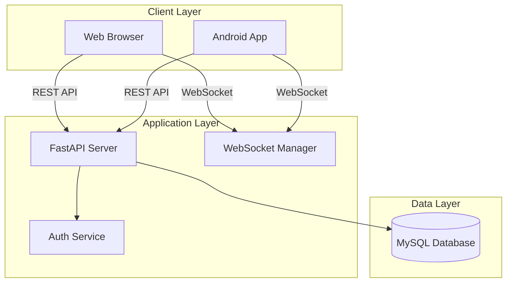
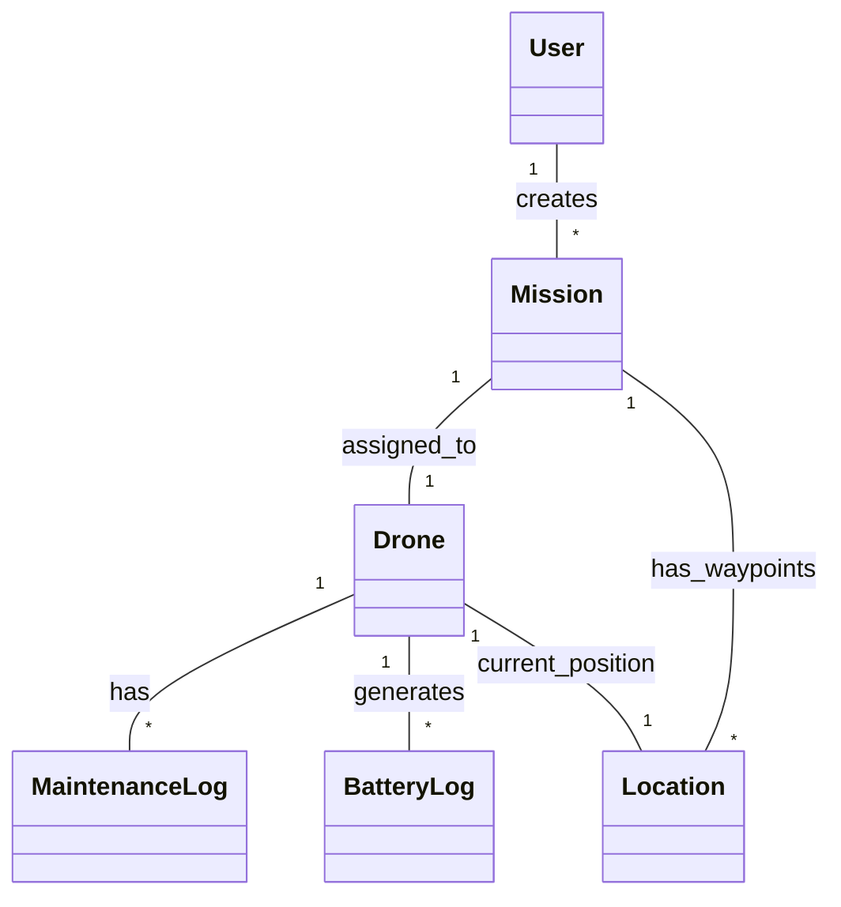
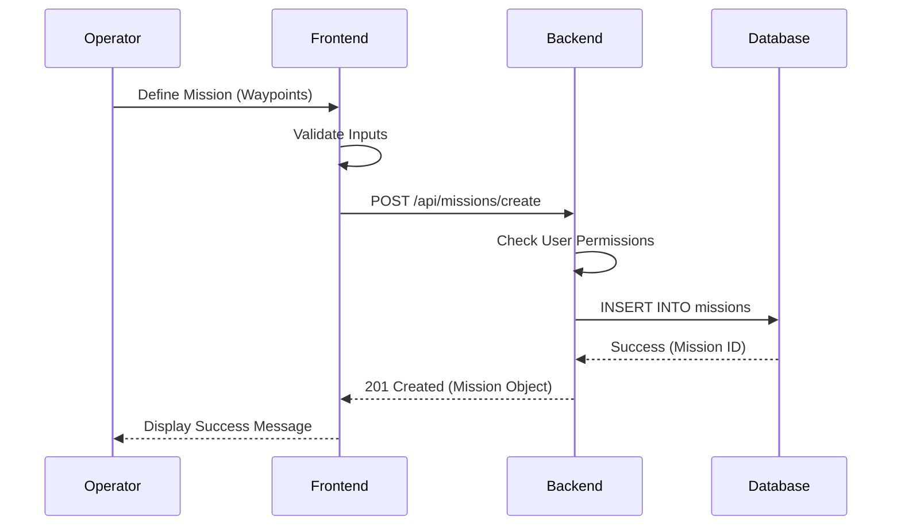
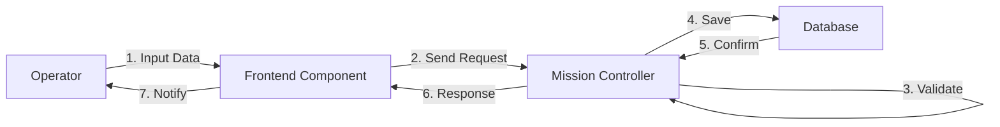
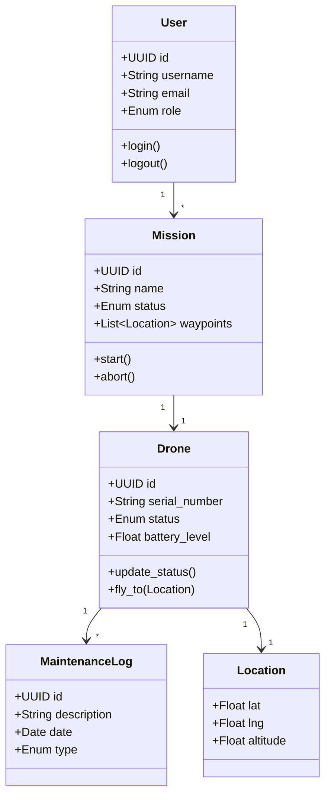
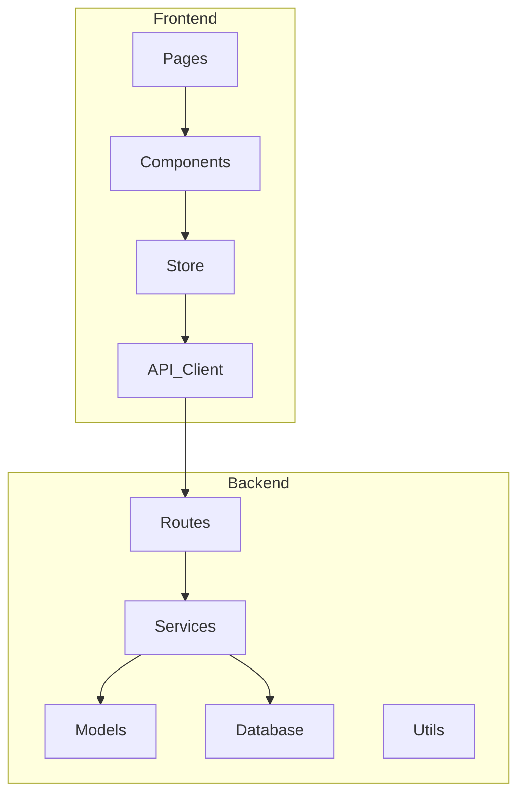

# 🚁 Drone MS: Advanced Drone Management System


> **SkyGuard** is a state-of-the-art Drone Management System (DMS) designed to orchestrate complex drone operations, ensure real-time fleet monitoring, and streamline mission planning. Built with a robust **FastAPI** backend, a dynamic **React** frontend, and **MySQL** for reliable data storage, it serves as a central command hub for drone operators and administrators. It now includes **Android** support via Capacitor.

---

## 🌟 Key Features

### 🎮 Operator Command Center
- **Mission Planning**: Interactive map interface (Google Maps) to plot missions with start, end, and multiple waypoints.
- **Real-Time Telemetry**: Live tracking of drone locations, altitude, speed, and battery status via WebSockets.
- **Phone-as-GPS**: Innovative feature allowing field operators to use their smartphone's GPS as a dynamic waypoint or tracking beacon.
- **AI Assistant**: Integrated AI assistant for hands-free queries, mission suggestions, and command support.

### 🔋 Fleet & Battery Management
- **Smart Battery Monitoring**: Real-time visualization of battery health, charge cycles, and temperature.
- **Predictive Alerts**: Automated warnings for low battery or critical maintenance needs.
- **Maintenance Tracking**: Log and schedule maintenance tasks to ensure fleet readiness.

### 🛡️ Admin & Security
- **Role-Based Access Control (RBAC)**: Distinct dashboards and permissions for Admins, Operators, and Maintenance staff.
- **Secure Authentication**: JWT-based secure login and session management.
- **Audit Logs**: Comprehensive tracking of user actions and system events.

### 📱 Mobile Support
- **Android App**: Fully functional Android application built with Capacitor, enabling field operations and mobile monitoring.

---

## 🏗️ System Architecture

The project follows a modern client-server architecture with real-time capabilities:

*   **Frontend**: A Single Page Application (SPA) built with **React**, **Vite**, and **Tailwind CSS**. State is managed by **Zustand**. It supports both web and mobile (via **Capacitor**) platforms.
*   **Backend**: A high-performance REST API built with **FastAPI** (Python). It handles business logic, data processing, and real-time **WebSocket** connections.
*   **Database**: **MySQL** is used for structured, relational storage of missions, users, drones, and telemetry data.

```mermaid
graph TD
    Client[Client (Browser/Mobile)]
    LB[Web Server / Load Balancer]
    API[FastAPI Backend]
    DB[(MySQL Database)]
    Ext[External APIs (Google Maps)]

    Client -->|HTTPS / WSS| LB
    LB --> API
    API -->|SQL (aiomysql)| DB
    API -->|HTTP Requests| Ext
```

---

## 🛠️ Technology Stack

### Frontend
| Tech | Description |
| :--- | :--- |
| **React** | UI Library for building interactive interfaces |
| **Vite** | Next-generation frontend tooling |
| **Tailwind CSS** | Utility-first CSS framework for rapid UI development |
| **Zustand** | Small, fast, and scalable state-management |
| **Capacitor** | Cross-platform native runtime for web apps (Android support) |
| **Google Maps API** | For mapping and location services |

### Backend
| Tech | Description |
| :--- | :--- |
| **FastAPI** | Modern, fast (high-performance) web framework for building APIs |
| **MySQL** | Relational database management system |
| **aiomysql** | Asyncio driver for MySQL |
| **WebSockets** | For real-time bi-directional communication |
| **JWT** | JSON Web Tokens for secure authentication |

---

## 📊 System Design & Modeling

### 1. Architecture Diagram
High-level view of the system components and their interactions.



### 2. Use Case Diagram
Describes the interactions between the system's actors and core functionalities.

```mermaid
usecaseDiagram
    actor Admin
    actor Operator
    actor Maintenance

    package "Drone Management System" {
        usecase "Manage Users" as UC1
        usecase "Plan Mission" as UC2
        usecase "Monitor Fleet" as UC3
        usecase "Control Drone" as UC4
        usecase "Schedule Maintenance" as UC5
        usecase "View Telemetry" as UC6
        usecase "AI Assistant Help" as UC7
        usecase "Phone GPS Tracking" as UC8
    }

    Admin --> UC1
    Admin --> UC3
    Operator --> UC2
    Operator --> UC3
    Operator --> UC4
    Operator --> UC6
    Operator --> UC7
    Operator --> UC8
    Maintenance --> UC5
    Maintenance --> UC6
```

### 3. Analysis Class Diagram
Represents the core domain concepts and their relationships.



### 4. Sequence Diagram (Create Mission)
Illustrates the dynamic flow of creating a new mission.



### 5. Collaboration Diagram (Create Mission)
Shows the structural relationship between objects during the mission creation process.



### 6. Design Class Diagram
Detailed view of the system's classes, attributes, and methods.



### 7. Package Diagram
Organizes the code structure into logical packages.



### 8. Component Diagram
Shows the high-level software components and their dependencies.

```mermaid
componentDiagram
    component "Web Browser" as Client
    component "Android Device" as Mobile
    component "FastAPI Backend" as Server
    component "MySQL Database" as DB
    component "Google Maps API" as Maps
    component "AI Service" as AI

    Client --> Server : REST/WebSocket
    Mobile --> Server : REST/WebSocket
    Server --> DB : SQL Query
    Client --> Maps : Map Rendering
    Server --> AI : Assistant Logic
```

### 9. Deployment Diagram
Visualizes the hardware and software nodes in the deployment environment.

```mermaid
graph TD
    node "Client Workstation" {
        [Web Browser]
    }
    node "Mobile Device" {
        [Android App]
    }
    node "Server Environment" {
        [FastAPI App]
        [MySQL Server]
    }

    [Web Browser] -- HTTPS --> [FastAPI App]
    [Android App] -- HTTPS --> [FastAPI App]
    [FastAPI App] -- TCP/3306 --> [MySQL Server]
```

---

## 🚀 Getting Started

### Prerequisites
Ensure you have the following installed on your system:
*   **Node.js** (v18+)
*   **Python** (v3.9+)
*   **MySQL** (Local instance or XAMPP)

### 📥 Installation

#### 1. Clone the Repository
```bash
git clone https://github.com/yourusername/skyguard-dms.git
cd skyguard-dms
```

#### 2. Backend Setup
```bash
cd backend

# Create virtual environment
python -m venv venv

# Activate virtual environment
# Windows:
.\venv\Scripts\activate
# Linux/Mac:
source venv/bin/activate

# Install dependencies
pip install -r requirements.txt
```

**Configuration**: Create a `.env` file in `backend/` with your MySQL credentials:
```env
MYSQL_HOST=localhost
MYSQL_PORT=3306
MYSQL_USER=root
MYSQL_PASSWORD=
MYSQL_DATABASE=drone_management_system
SECRET_KEY=your_super_secret_key_here
```

#### 3. Frontend Setup
```bash
cd ../frontend

# Install dependencies
npm install
```

**Configuration**: Create a `.env` file in `frontend/` with:
```env
VITE_API_URL=http://localhost:8000
VITE_GOOGLE_MAPS_API_KEY=your_google_maps_api_key
```

---

## 🏃‍♂️ Usage

### Starting the Application

**Option 1: Quick Start (Windows)**
Simply double-click the `click_to_start.bat` file in the root directory. This will launch both the backend and frontend servers automatically.

**Option 2: Manual Start**

1.  **Start Backend**:
    ```bash
    cd backend
    uvicorn main:app --reload
    ```
2.  **Start Frontend**:
    ```bash
    cd frontend
    npm run dev
    ```

### Accessing the App
*   **Frontend**: Open [http://localhost:5173](http://localhost:5173) in your browser.
*   **API Docs**: Open [http://localhost:8000/docs](http://localhost:8000/docs) for the interactive Swagger UI.

---

## 📄 License

Distributed under the MIT License. See `LICENSE` for more information.

---

<div align="center">
  <sub>Built with ❤️ by Muzzammil</sub>
</div>
